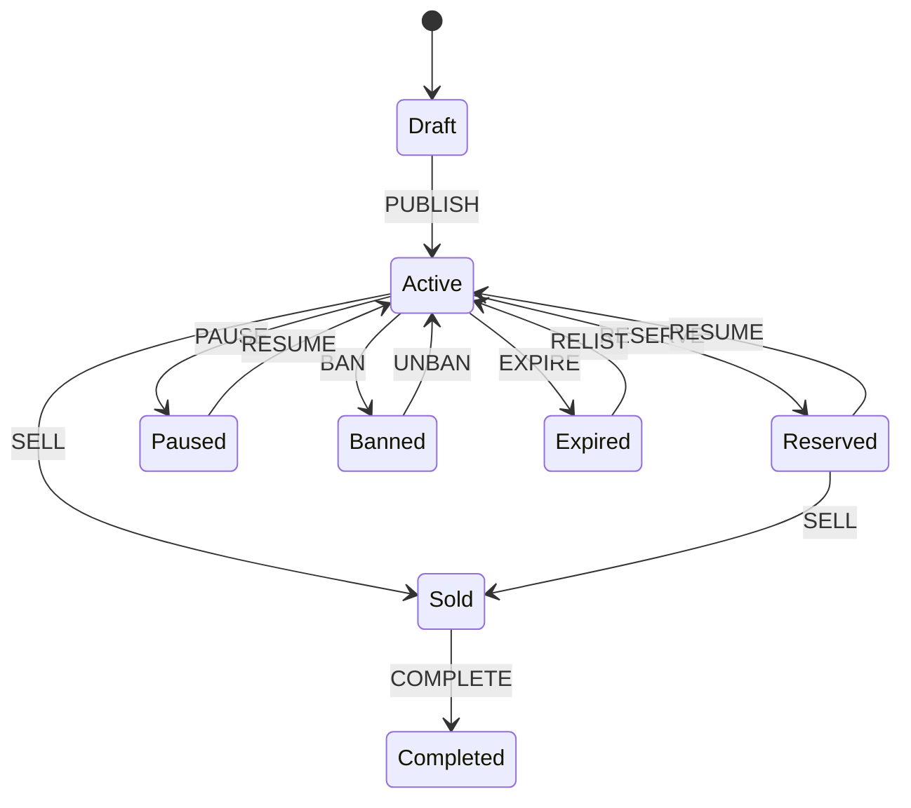
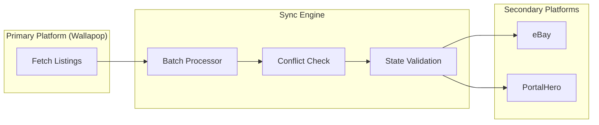
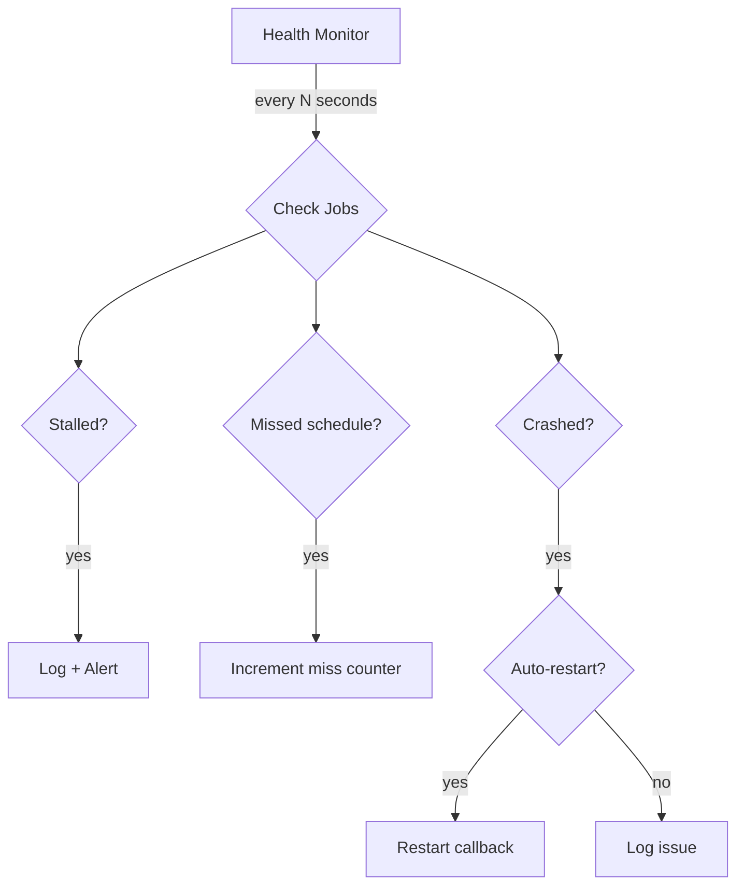

# Marketplace Sync Engine


Multi-platform listing synchronization engine with **job scheduling**, **state-machine lifecycle management**, **cross-platform conflict resolution**, and **health-monitoring watchdog**.

Built as a reusable backbone for marketplace automation across Wallapop, eBay, PortalHero, and similar platforms.

---

## Features

| Module | Description |
|---|---|
| **Scheduler** | APScheduler wrapper with named job registry, duplicate prevention, and pause/resume |
| **Sync Engine** | Primary → secondary orchestrator with batching and platform adapter protocol |
| **State Machine** | Listing lifecycle (Draft → Active → Sold → Completed) with validated transitions |
| **Conflict Resolver** | Detects price/status mismatches; strategies: *Last-Write-Wins*, *Primary-Wins*, *Manual-Review* |
| **Health Monitor** | Watchdog that detects stalled jobs, missed schedules, and auto-restarts crashed workers |
| **Thread Pool** | Managed `ThreadPoolExecutor` with task tracking, stats, and graceful shutdown |

---

## Architecture

### Listing State Machine



### Sync Flow



### Watchdog Loop



---

## Quick Start

```bash
# Clone
git clone https://github.com/AspiranteD/marketplace-sync-engine.git
cd marketplace-sync-engine

# Install dependencies
pip install -r requirements.txt

# Run tests
python -m pytest tests/ -v

# Run demo
python -m examples.sync_demo
```

---

## Usage

### Sync Engine with Platform Adapters

```python
from src.sync import SyncEngine

engine = SyncEngine(
    primary=wallapop_adapter,
    secondaries=[ebay_adapter, portalhero_adapter],
    batch_size=50,
)

stats = engine.sync_all()
print(f"Synced: {stats.synced}, Conflicts: {stats.conflicts}")
```

### Listing State Machine

```python
from src.sync import ListingStateMachine, ListingEvent

sm = ListingStateMachine()       # starts at DRAFT
sm.transition(ListingEvent.PUBLISH)   # → ACTIVE
sm.transition(ListingEvent.RESERVE)   # → RESERVED
sm.transition(ListingEvent.SELL)      # → SOLD
```

### Job Scheduler

```python
from src.scheduler import JobScheduler

scheduler = JobScheduler()
scheduler.add_job("price_sync", engine.sync_prices, "interval", minutes=15)
scheduler.add_job("full_sync", engine.sync_all, "cron", hour=3)
scheduler.start()
```

---

## Design Decisions

### Why a State Machine for Listings?

Marketplace listings have strict lifecycle rules — you can't sell a draft, you can't pause a completed sale. A state machine makes invalid transitions impossible at the code level, preventing data corruption across platforms.

### Why Primary-Wins as Default Strategy?

In multi-platform selling, one platform is always the "source of truth" (usually where the seller manages inventory). Primary-Wins avoids race conditions where a stale eBay price overwrites a fresh Wallapop update. Last-Write-Wins is available for peer-to-peer sync scenarios.

### Why APScheduler over Celery?

This engine runs as a single-process library, not a distributed system. APScheduler is lightweight, has no broker dependency (no Redis/RabbitMQ), and supports both cron and interval triggers out of the box. Celery would be overkill for this use case.

---

## Related Projects

- [wallapop-data-extractors](https://github.com/AspiranteD/wallapop-data-extractors) — Scraping and data extraction from Wallapop
- [ebay-automation-toolkit](https://github.com/AspiranteD/ebay-automation-toolkit) — eBay listing automation tools

---

## License

MIT
